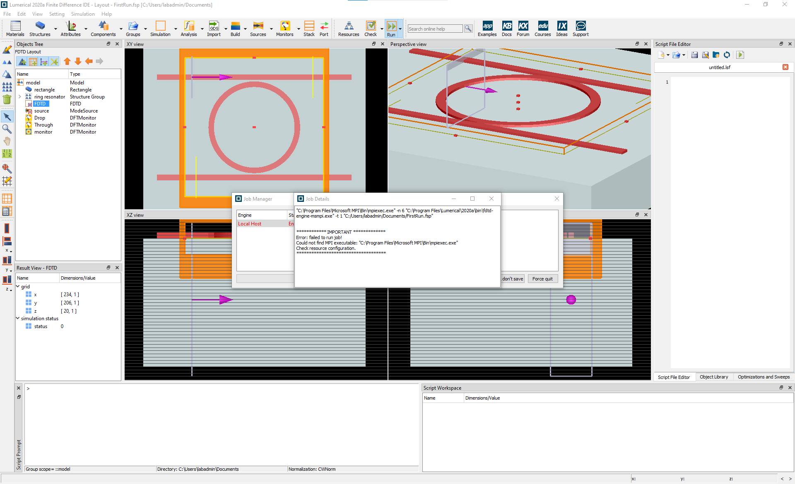
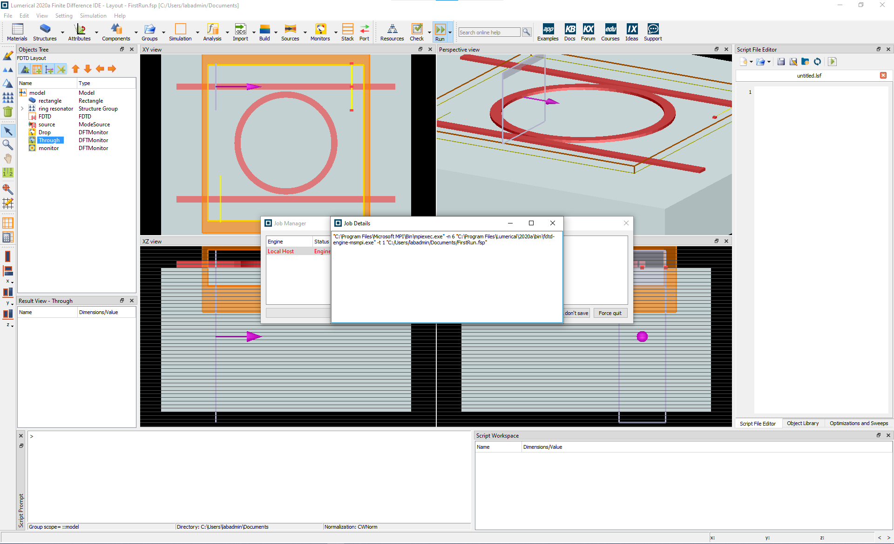

# Installing Lumerical at MPL

### Requirements ###

2021/02/15 - Tested on Windows 10 and Lumerical 2020a.

Before beginning, either download or clone **Microsoft MPI.7z** and **msmpi.dll** from this repository. Unzip the **Microsfot MPI** folder. Do not change any of the filenames for the downlaod files.

### Background ###

Email IT with a request to install Lumerical. When the installation is complete, Lumerical will open, however, an error is thrown anytime a simulaton is started.

The reason for this error is that Microsoft MPI (Message Passing Interface) along with the DLL (dynamic link library) is missing. Installing directly from the Microsoft installer or Github does not work so instead we install Microsoft MPI and the DLL manually.

### Procedure ###

Firstly, the Microsoft MPI program is missing as shown in the following image.

Download a Microsoft MPI program image and manually install it under *C:/Program Files*.

The following error is less obvious as there is no clear indication of what is missing.

The corresponding DLL for Microsoft MPI is missing and it should be installed under *C:/Windows/System32*. Be careful not to remove anything from this folder!

Once both Microsoft MPI and its DLL are installed, Lumerical should run.